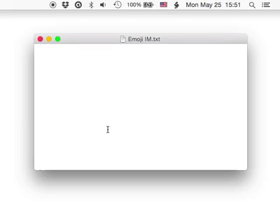

# Emoji IM

Emoji IM is an input method for Emojis. You can input alphabetical characters and Emojis seamlessly👍

- [Website](http://genjiapp.com/mac/emoji-im/index_en.html)
- [User Manual](http://genjiapp.com/mac/emoji-im/manual_en.html)
- [Download Installer Package from Gumroad.com](https://gum.co/emoji-im)

# 🐱System Requirements

OS X 10.10+